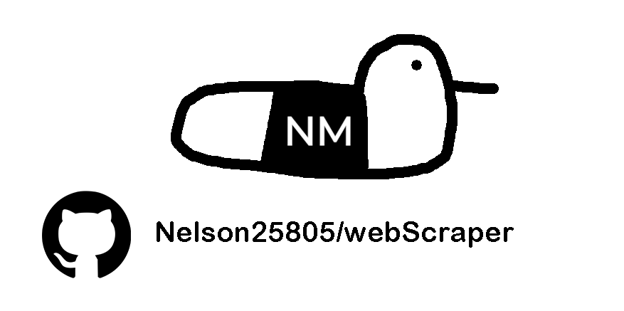

<a id="readme-top"></a>

<!-- PROJECT SHIELDS -->
<!--
*** I'm using markdown "reference style" links for readability.
*** Reference links are enclosed in brackets [ ] instead of parentheses ( ).
*** See the bottom of this document for the declaration of the reference variables
*** for contributors-url, forks-url, etc. This is an optional, concise syntax you may use.
*** https://www.markdownguide.org/basic-syntax/#reference-style-links
-->
[![Contributors][contributors-shield]][contributors-url]
[![Forks][forks-shield]][forks-url]
[![Stargazers][stars-shield]][stars-url]
[![Issues][issues-shield]][issues-url]
[![project_license][license-shield]][license-url]
[![LinkedIn][linkedin-shield]][linkedin-url]

<!-- PROJECT LOGO -->
<br />
<div align="center">
  <a href="https://github.com/Nelson25805/webScraper">
    
  </a>

<h3 align="center">Web Scrapper</h3>


  <p align="center">
    An application to scrape websites of data on the page, including images.
    <br />
    <a href="https://github.com/Nelson25805/webScraper"><strong>Explore the docs »</strong></a>
    <br />
    <br />
    <a href="https://github.com/Nelson25805/webScraper">View Demo</a>
    &middot;
    <a href="https://github.com/Nelson25805/WEBsCRAPER/issues/new?labels=bug&template=bug-report---.md">Report Bug</a>
    &middot;
    <a href="https://github.com/Nelson25805/webScraper/issues/new?labels=enhancement&template=feature-request---.md">Request Feature</a>
  </p>
</div>

<!-- TABLE OF CONTENTS -->
<details>
  <summary>Table of Contents</summary>
  <ol>
    <li>
      <a href="#about-the-project">About The Project</a>
      <ul>
        <li><a href="#built-with">Built With</a></li>
      </ul>
    </li>
    <li>
      <a href="#getting-started">Getting Started</a>
      <ul>
        <li><a href="#installation">Installation</a></li>
      </ul>
    </li>
    <li><a href="#usage">Usage</a></li>
    <!-- <li><a href="#roadmap">Roadmap</a></li> -->
    <li><a href="#contributing">Contributing</a></li>
    <li><a href="#license">License</a></li>
    <li><a href="#contact">Contact</a></li>
  </ol>
</details>


<!-- ABOUT THE PROJECT -->
## About The Project

![Project Name Screen Shot][project-screenshot]

This small Streamlit application fetches a webpage (requests + BeautifulSoup), extracts text/HTML elements and image URLs, shows image metadata and optionally downloads images and metadata as CSV / Excel / ZIP.

The app is built for educational use and quick ad-hoc scraping tasks where JavaScript rendering is not required. It deliberately keeps everything local — there is no cloud storage or telemetry.

### Key features

- Fetch page HTML using a resilient HttpClient (retries + backoff).
- Extract elements by CSS selector or run against the whole page.
- Extract images (unique URLs) with rich metadata: alt, title, caption (figcaption), surrounding text, container text, and optional OCR text.
- Preview results in the Streamlit UI and download:
- extracted text/results as CSV
- image metadata as CSV or Excel (.xlsx)
- downloaded images as a ZIP archive
- Optional OCR using pytesseract + Pillow when enabled by the user.
- Adjustable limits for elements and images to avoid huge downloads.

This project is intended for educational purposes and personal use, focusing on clean Ruby design and fundamental security concepts.
<p align="right">(<a href="#readme-top">back to top</a>)</p>


## Built With

| Badge | Description |
|:-----:|-------------|
| [][Python-url] | Core programming language. |
| [][Streamlit-url] | Lightweight web UI for the app. |
| [][BeautifulSoup-url] | HTML parsing and CSS selection. |
| [][Pandas-url] | Used for nicer tables / excel output. |
| [][Pillow-url] | pytesseract (optional) — OCR support. |


<p align="right">(<a href="#readme-top">back to top</a>)</p>


<!-- GETTING STARTED -->
## Getting Started

To start, you have two options of using this software.
1) Run the .exe file
2) Run the python code script manually

## Installation

1. Clone the repo
   ```sh
   git clone https://github.com/Nelson25805/webScraper.git
   ```
   
2. If using option 1, skip to step 5.
   If using option 2, continue reading.
   
3. You must have python downloaded on your machine, or in your IDE of choice.
   [Python Download](https://www.python.org/downloads/)

4. Install the required packages:
   ```sh
   pip install -r requirements.txt
   ```
   
5. Create account for IGDB Api requests following their steps:
   [IGDB Api Getting Started](https://api-docs.igdb.com/#getting-started)

7. Create a .env file with your unique CLIENT_ID, and CLIENT_SECRET as shown in this fake test example here:
   ![Project Name Screen Shot][project-screenshot5]

8. Depending on where you run the application, place .env file into same folder as .exe, and or the main project folder. 

9. Either run the application from the .exe in the dlist folder, or by executing:
    ```sh
   python main.py
   ```

<p align="right">(<a href="#readme-top">back to top</a>)</p>

<!-- USAGE EXAMPLES -->
## Usage

Start the app: streamlit run webScraper.py.

In the sidebar provide:

Website URL — target page to fetch (e.g. https://example.com).

CSS selector (optional) — narrow extraction to specific elements (e.g. .post, article, div.product). Leave empty to run on the whole page.

Limit — number of elements to return (0 = all).

Scrape images — toggle to extract image metadata and download images.

Max images to download — limits image results when downloading.

Run OCR on images (slow, optional) — requires Tesseract + pytesseract + Pillow.

Hit Scrape. Results will appear in the main area (table/list). Use the download buttons to get CSV, Excel, or ZIP files.

This tool fetches and downloads content from the web. Respect site terms of service, copyright, and robots.txt. Do not use this tool for scraping private or protected data.

<p align="right">(<a href="#readme-top">back to top</a>)</p>


<!-- ROADMAP -->
<!--
## Roadmap

- [ ] Feature 1
- [ ] Feature 2
- [ ] Feature 3
    - [ ] Nested Feature

See the [open issues](https://github.com/Nelson25805/igdbGameInfo/issues) for a full list of proposed features (and known issues).

<p align="right">(<a href="#readme-top">back to top</a>)</p>
-->

<!-- CONTRIBUTING -->
## Contributing

Contributions are what make the open source community such an amazing place to learn, inspire, and create. Any contributions you make are **greatly appreciated**.

If you have a suggestion that would make this better, please fork the repo and create a pull request. You can also simply open an issue with the tag "enhancement".
Don't forget to give the project a star! Thanks again!

1. Fork the Project
2. Create your Feature Branch (`git checkout -b feature/AmazingFeature`)
3. Commit your Changes (`git commit -m 'Add some AmazingFeature'`)
4. Push to the Branch (`git push origin feature/AmazingFeature`)
5. Open a Pull Request

<p align="right">(<a href="#readme-top">back to top</a>)</p>

## Top contributors:

<a href="https://github.com/Nelson25805/webScraper/graphs/contributors">
  
</a>


<!-- LICENSE -->
## License

Distributed under the project_license. See `LICENSE.txt` for more information.

<p align="right">(<a href="#readme-top">back to top</a>)</p>


<!-- CONTACT -->
## Contact

Nelson McFadyen <!-- - [@twitter_handle](https://twitter.com/twitter_handle) --> - Nelson25805@hotmail.com

Project Link: [https://github.com/Nelson25805/igdbGameInfo](https://github.com/Nelson25805/webScraper)

<p align="right">(<a href="#readme-top">back to top</a>)</p>


<!-- MARKDOWN LINKS & IMAGES -->
<!-- https://www.markdownguide.org/basic-syntax/#reference-style-links -->
[contributors-shield]: https://img.shields.io/github/contributors/Nelson25805/igdbGameInfo.svg?style=for-the-badge
[contributors-url]: https://github.com/Nelson25805/igdbGameInfo/graphs/contributors
[forks-shield]: https://img.shields.io/github/forks/Nelson25805/igdbGameInfo.svg?style=for-the-badge
[forks-url]: https://github.com/Nelson25805/igdbGameInfo/network/members
[stars-shield]: https://img.shields.io/github/stars/Nelson25805/igdbGameInfo.svg?style=for-the-badge
[stars-url]: https://github.com/Nelson25805/igdbGameInfo/stargazers
[issues-shield]: https://img.shields.io/github/issues/Nelson25805/igdbGameInfo.svg?style=for-the-badge
[issues-url]: https://github.com/Nelson25805/igdbGameInfo/issues
[license-shield]: https://img.shields.io/github/license/Nelson25805/igdbGameInfo.svg?style=for-the-badge
[license-url]: https://github.com/Nelson25805/igdbGameInfo/blob/master/LICENSE.txt
[linkedin-shield]: https://img.shields.io/badge/-LinkedIn-black.svg?style=for-the-badge&logo=linkedin&colorB=555
[linkedin-url]: https://www.linkedin.com/in/nelson-mcfadyen-806134133/


[project-screenshot]: GithubImages/mainScreen.png
[project-screenshot2]: GithubImages/filteredGameSearch.gif
[project-screenshot3]: GithubImages/randomGameSearch.gif

[project-screenshot4]: GithubImages/excelExample.png
[project-screenshot5]: GithubImages/envExample.png


[Python-url]: https://www.python.org/
[Streamlit-url]: https://streamlit.io/
[BeautifulSoup-url]: https://pypi.org/project/beautifulsoup4/
[Pandas-url]: https://pandas.pydata.org/
[Pillow-url]: https://pypi.org/project/pillow/

[Python]: https://img.shields.io/badge/python-3670A0?style=for-the-badge&logo=python&logoColor=ffdd54
